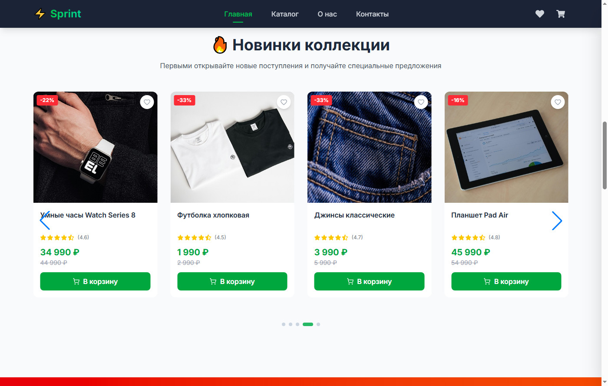
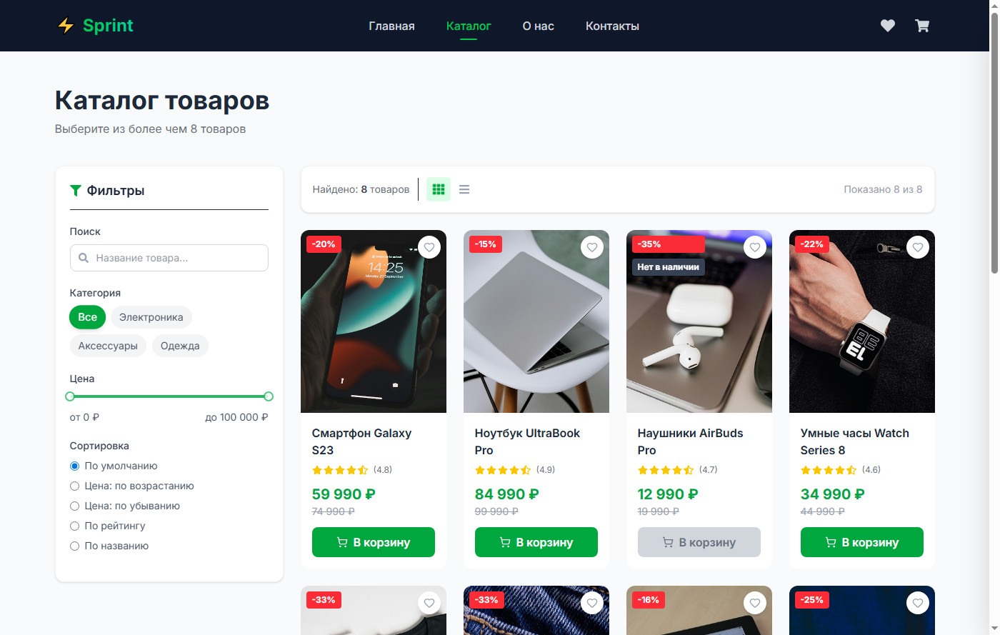
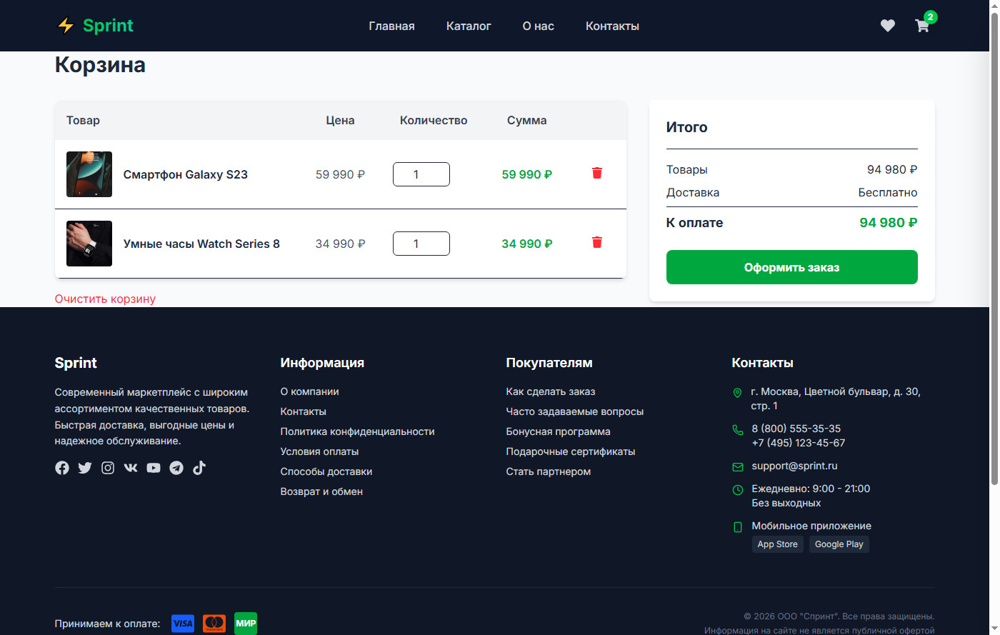
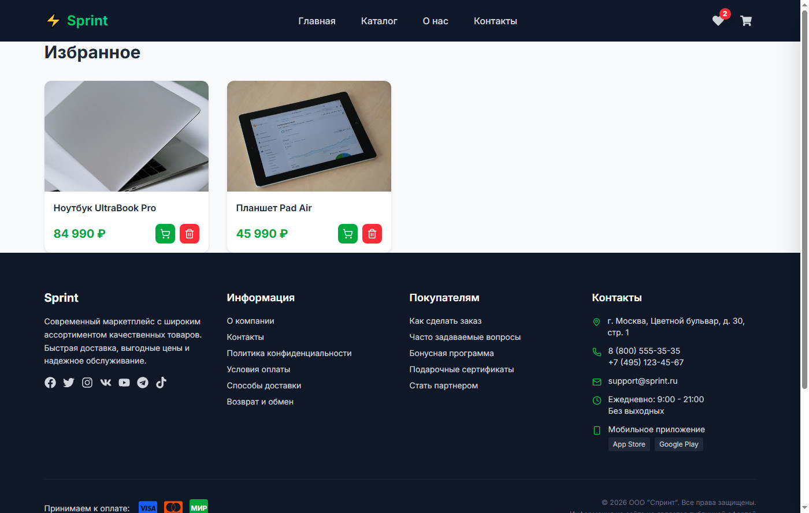
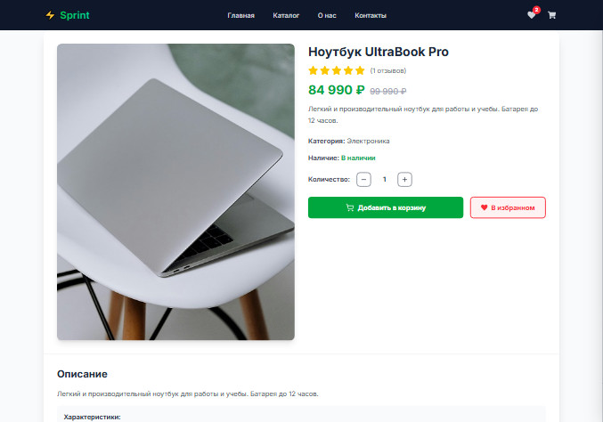
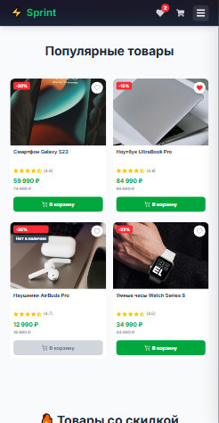
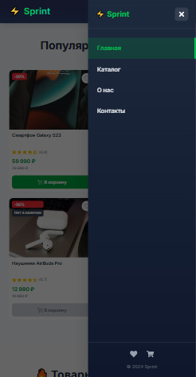

# 🛍️ Sprint - Интернет-магазин


## 📸 Скриншоты

### Десктоп версия

| Главная страница | Каталог |
|-----------------|---------|
|  |  |

| Корзина | Избранное |
|---------|-----------|
|  |  |

| Детальная карточка товара |
|---------------------------|
|  |

### Мобильная версия

| Главная (мобильная) | Меню (мобильное) |
|---------------------|------------------|
|  |  |

## 🚀 Демо

[Посмотреть демо](https://semeeensemeeenov23.github.io/ecommerce-shop/)

## 📱 Функционал

- ✅ Каталог товаров с фильтрацией и сортировкой
- ✅ Поиск по товарам
- ✅ Пагинация
- ✅ Корзина с сохранением в localStorage
- ✅ Избранное (Wishlist)
- ✅ Оформление заказа
- ✅ Страницы: О нас, Контакты
- ✅ Адаптивный дизайн (мобильные, планшеты, десктоп)
- ✅ Плавные анимации (Framer Motion)
- ✅ Плавающие GIF-анимации для привлечения внимания

## 🛠 Технологии

- **React 19** + **TypeScript**
- **Vite** - сборка
- **Tailwind CSS** - стилизация
- **Redux Toolkit** - управление состоянием
- **React Router** - навигация
- **Framer Motion** - анимации
- **Swiper** - слайдеры

## 📦 Установка и запуск

```bash
# Клонировать репозиторий
git clone https://github.com/semeeensemeeenov23/ecommerce-shop.git

# Перейти в папку проекта
cd ecommerce-shop

# Установить зависимости
npm install

# Запустить в режиме разработки
npm run dev

# Собрать для продакшена
npm run build

# Предпросмотр сборки
npm run preview